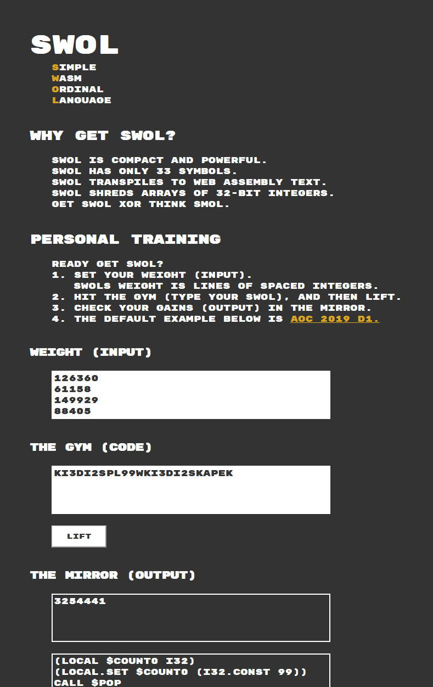
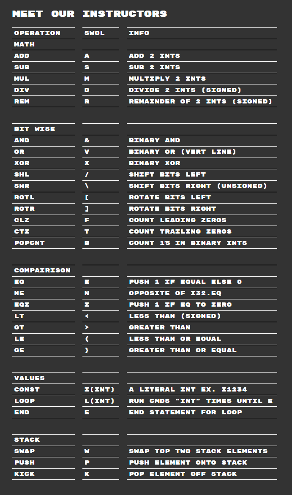

# SWOL

A simple lauguage for getting you the gains you deserve in Advent of Code built on top of a stack machine implemented in WebAssembly (WAT).

# Images

# Todo

- [ ] Replace `output` divs with readonly text areas that scroll vertically and horizontally.
- [ ] Implement parsing of SWOL code.
