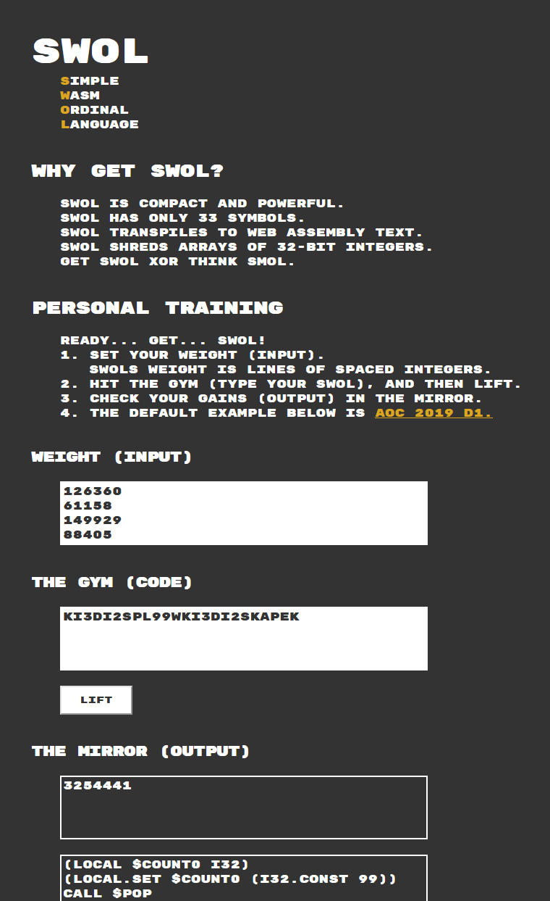

# SWOL

A simple lauguage for getting you the gains you deserve in Advent of Code built on top of a stack machine implemented in WebAssembly (WAT).

[Hit the Gym](https://strawstack.github.io/Swol/)

# Images

