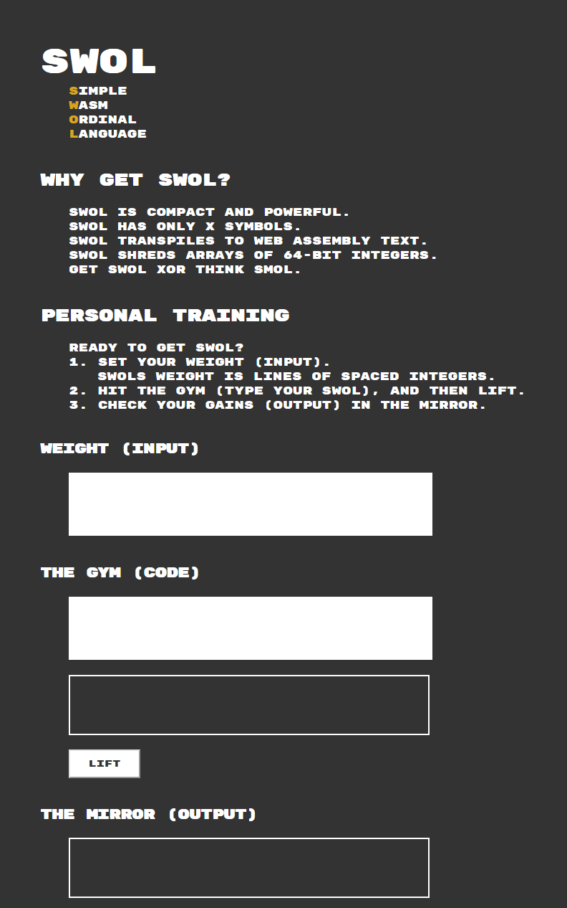
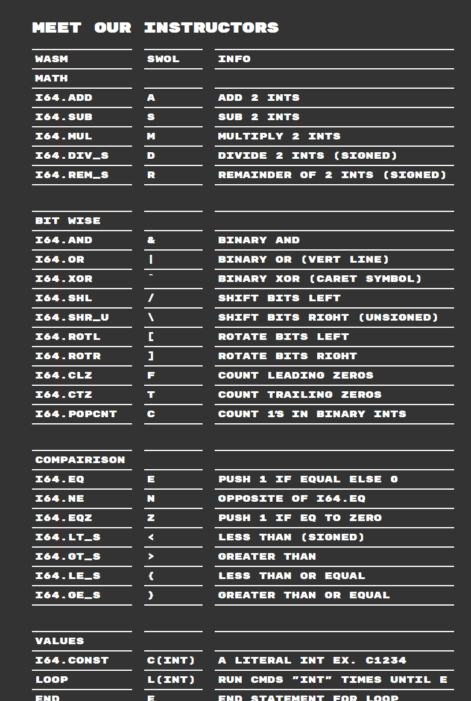

# SWOL

A simple lauguage for commanding a stack machine implemented in WebAssembly (WAT).

# Note

Due to the implementation decision that WASM loops and functions can't leave values on the local stack when exting it is not possible to use the local stack as that stack that is commanded by SWOL.

A heap-stack can be used instead. A stack implemented in WASM that uses a pointer to a memory address in WASM to track the values on the stack in a way that is globally accessible to all parts of the generated WASM program (generated by compiling SWOL).

So, using a WASM memory space and a pointer, we can build a stack machine in WASM. Then we can implement  operations accessible from SWOL that "compile" to a few lines of WASM. The few lines of WASM will execute push, pop, math operations on the WASM stack. For example, "A" is "add" and pops two numbers off the WASM stack adds them and pushes the result.   

# Images

# Todo

- [ ] Replace `output` divs with readonly text areas that scroll vertically and horizontally.
- [ ] Implement parsing of SWOL code.
